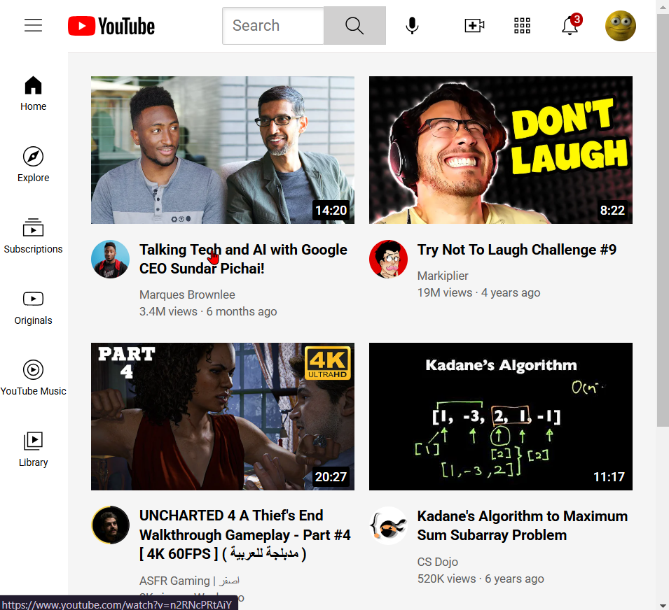

# YouTube Clone

## Overview
This project is a front-end imitation of YouTube, built using HTML and CSS. It replicates key components of the YouTube interface, including the header, sidebar, and video grid. The design focuses on recreating the visual layout and functionality of YouTube's main page.

## Features
1. **Header Section**:
   - Includes a search bar, search and voice search buttons.
   - Icons for uploading content, accessing YouTube apps, viewing notifications, and a user profile picture.

2. **Sidebar**:
   - Contains links to sections like Home, Explore, Subscriptions, Originals, YouTube Music, and Library.
   - Highlights each link on hover for better interactivity.

3. **Video Grid**:
   - Displays video previews in a grid layout.
   - Each preview includes:
     - Thumbnail image with video duration.
     - Video title, author, view count, and upload date.
     - A link to the video.
     - Channel profile picture for each video.

## Technologies Used
- **HTML**: Structures the webpage.
- **CSS**: Styles the page, including:
  - A fixed sidebar for navigation.
  - A responsive layout for the video grid.
  - Tooltips and hover effects for interactivity.
## Full Page View

